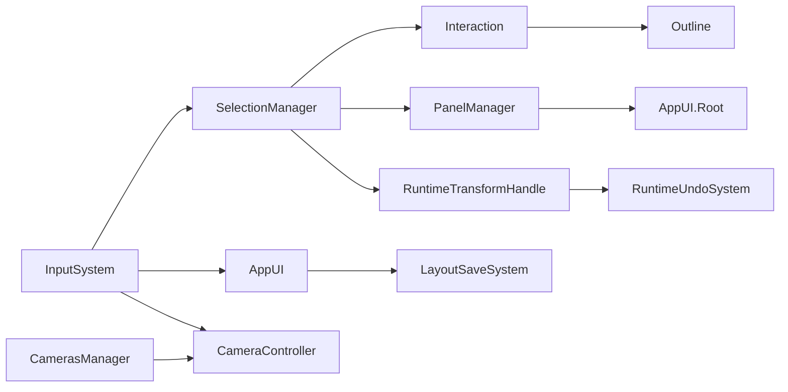

# AppUI overview

## Purpose

**AppUI** is the root runtime UI controller: UIToolkit document host, pointer validity for scene input, global shortcuts, exit/save-layout flows, and floating panel tracking.

## Type and location

| | |
|--|--|
| **Class** | `OC.UI.AppUI` |
| **Script** | [`Runtime/System/Scripts/AppUI.cs`](../../Runtime/System/Scripts/AppUI.cs) |
| **Prefab** | [`Runtime/Prefabs/AppUI.prefab`](../../Runtime/Prefabs/AppUI.prefab) (nested under **Interactions**) |
| **Pattern** | `MonoBehaviourSingleton<AppUI>` |

Requires **`UIDocument`** on the same GameObject.

## Responsibilities

### Pointer state

Updated each frame:

| Property | Meaning |
|----------|---------|
| `IsPointerOverUI` | EventSystem reports pointer over UI |
| `IsPointerFocused` | Application has focus |
| `IsPointerInsideScreen` | Mouse within screen bounds |
| `IsPointerValidForAction` | Not over UI, focused, inside screen — used by cameras and selection |

### Root visual tree

- **`Root`** — `UIDocument.rootVisualElement`, centered flex layout.
- Hosts **exit popup**, **save layout popup**, and panels added by **PanelManager**.

### Input actions

| Action | Behavior |
|--------|----------|
| **Cancel** | Deselect last interaction → close last floating panel → toggle exit popup |
| **Window** | Toggle windowed vs full-screen window mode |

### Layout save on quit

If **`LayoutSaveSystem`** reports dirty state when closing the exit popup, **SaveLayoutPopup** prompts save / discard / cancel before `Application.Quit()`.

### Floating panels

**`Register` / `Unregister`** track **`IFloatingPanel`** instances for cancel-to-close behavior.

## Toolbar subsystem

**[`ToolWindowsManager`](../../Runtime/System/Scripts/ToolWindowsManager.cs)** (on AppUI prefab):

- Loads `UXML/toolbar_subsystem` and stylesheet `toolbar`.
- Calls **`Populate`** on child components implementing **`IPopulateVisualTree`** (`ToolbarItem`, `ToolbarWindow`).

See [Toolbar Tools](Toolbar-Tools.md) for each tool.

## Editor tools panel

**[`EditorToolsPanel`](../../Runtime/System/Scripts/Toolbar/EditorToolsPanel.cs)** — separate toolbar (not the subsystem strip):

- **View / Move / Rotate** → `RuntimeTransformHandle.Instance.Tool`
- **Center** → pivot vs center
- **Global** → world vs local coordinates
- Shown only when selection is non-empty

## Architecture

## Setup

1. Use **Interactions** prefab (embeds AppUI) or place **AppUI** prefab manually.
2. Ensure **Event System** exists in the scene.
3. Assign **Cancel** and **Window** input actions.
4. Child toolbar objects implement tools — see [Toolbar Tools](Toolbar-Tools.md).

## Related

- [Toolbar Tools](Toolbar-Tools.md)
- [Panel Manager](../Subsystems/Panel-Manager.md)
- [Selection Manager](../Subsystems/Selection-Manager.md)
- [Modules/Component-Layout.md](../Modules/Component-Layout.md)
- [Scene Setup](../Scene-Setup.md)
