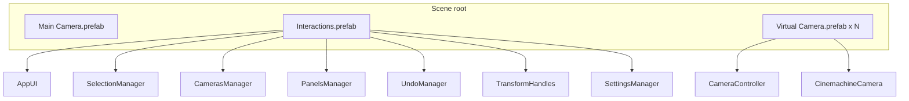

# Scene setup

## Purpose

Configure a commissioning scene with the prefabs and hierarchy required for selection, cameras, panels, and UI tools.

## Recommended hierarchy

## Step-by-step

### 1. Main Camera

Drag **[`Runtime/Prefabs/Main Camera.prefab`](../Runtime/Prefabs/Main%20Camera.prefab)** into the scene.

- Tagged **`MainCamera`** (used by `SelectionManager` for raycasts).
- URP **Universal Additional Camera Data** with **Post Processing** enabled (required for outlines).
- **Audio Listener** included.

### 2. Interactions root

Drag **[`Runtime/Prefabs/Interactions.prefab`](../Runtime/Prefabs/Interactions.prefab)** into the scene.

This single prefab bootstraps most runtime systems:

| Child (prefab name) | Component / role |
|---------------------|------------------|
| AppUI | UI shell, toolbar tools, popups |
| SelectionManager | Object selection and pointer events |
| CamerasManager | Active virtual camera switching |
| PanelsManager | `PanelManager` + default `PanelHandler` list |
| SettingsManager | Mouse sensitivity, visual config, auto-load layout |
| TransformHandles | Move/rotate gizmos (`RuntimeTransformHandle`) |
| UndoManager | `RuntimeUndoSystem` |

### 3. Virtual cameras

For each camera view (e.g. overview, detail, side):

1. Duplicate **[`Runtime/Prefabs/Virtual Camera.prefab`](../Runtime/Prefabs/Virtual%20Camera.prefab)**.
2. Position the root in the scene.
3. Each instance contains:
   - **`CameraController`** on the root
   - **`Pivot`** child (orbit target)
   - **`Cinemachine Camera`** child (Cinemachine 3)

`CamerasManager` discovers all `CameraController` instances on enable and activates one at a time. See [Subsystems/Cameras-Manager.md](Subsystems/Cameras-Manager.md).

### 4. Event System

Ensure the scene has a Unity **Event System** (required for `AppUI` to detect pointer-over-UI and for interaction pointer events).

### 5. Volume (outline)

Add a global or local **Volume** with the **Outline** override. Use `Runtime/Settings/OC Volume.asset` as a reference profile.

### 6. Commissioning objects

On each interactable device or assembly:

1. Add **`Interaction`** from the **`OC`** assembly (`OC.Interactions`).
2. Optional package components:
   - **`Outline`** — hover/selection highlight (auto-added in Editor when `Interaction` is added)
   - **`RuntimeInspector`** — editable transform fields in UI
   - **`ColliderMaterial`** — debug collider visualization (Collider View tool)
   - **`Label`** — world-space name label (Label tool)
   - **`HideGroup`** — group hide/transparent (Hide tool)

Ensure colliders are on a layer included in **`SelectionManager`**’s layer mask (default: **layer 10**, mask value `1024`).

### 7. Input and UI

- Confirm **OC Input Actions** are assigned on `Interactions` and camera prefabs.
- Enable the **Interaction Tool** in the toolbar at runtime to allow selection (see [AppUI/Toolbar-Tools.md](AppUI/Toolbar-Tools.md)).

## Minimal checklist

- [ ] URP active, outline renderer feature and volume configured ([Setup](Setup.md))
- [ ] `Main Camera` in scene with post-processing
- [ ] `Interactions` prefab in scene
- [ ] One or more `Virtual Camera` prefab instances
- [ ] Event System present
- [ ] `Interaction` (+ colliders) on commissioning objects, correct physics layer
- [ ] Rendering layers `Outline_1`–`Outline_4` defined

## Reference scenes

| Scene | Path |
|-------|------|
| Basic devices demo | `Samples/Basic Demo/0.1 Devices.unity` |
| Components UI test | `Tests/Scenes/0.1 Components UI.unity` |
| Panels test | `Tests/Scenes/0.2 Components UI - Panels.unity` |

> **Note:** `package.json` lists sample paths `Samples~/Demo` and `Samples~/Environment` that are not present in this repository. Use **Basic Demo** and **Tests/Scenes** instead.

## Troubleshooting

| Symptom | Likely cause |
|---------|----------------|
| Cannot select objects | **Interaction Tool** off (`SelectionManager.Enable == false`); wrong **layer mask**; no collider on object |
| No outline on hover/select | Missing **`Outline`** component; rendering layers not named `Outline_1`/`Outline_2`; post-processing disabled on camera |
| Camera does not move | Wrong camera active; pointer over UI; `AppUI.IsPointerValidForAction` is false |
| No component panel on select | No matching **`PanelHandler`** for the selected component type; `PanelManager` not in scene |
| Toolbar tools do nothing | Missing singleton (`LabelManager`, `ColliderViewSystem`) in scene; broken UnityEvent wiring on AppUI prefab |

## Related

- [Setup](Setup.md)
- [Components/Virtual-Camera.md](Components/Virtual-Camera.md)
- [Components/Interaction.md](Components/Interaction.md)
- [AppUI/Overview.md](AppUI/Overview.md)
