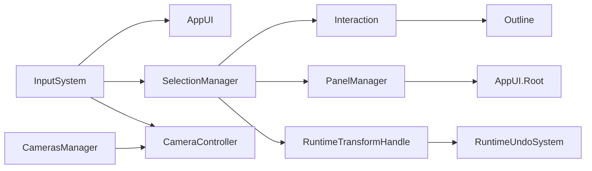

# Open Commissioning UI

Unity package **`com.spiratec.oc.ui`** — runtime UI for Open Commissioning (URP, UIToolkit, Input System).

## Quick start

1. **Add packages** — [Documentation/Setup.md](Documentation/Setup.md)  
   Add `com.spiratec.oc.ui` and `com.cqf.outline` to `Packages/manifest.json`, plus host **`OC`** assembly, UniTask, and NaughtyAttributes.

2. **Configure URP and outline** — [Documentation/Setup.md](Documentation/Setup.md), [Documentation/Components/Outline.md](Documentation/Components/Outline.md)  
   URP renderer with `OutlineRendererFeature`, volume override, rendering layers `Outline_1`–`Outline_4`, post-processing on camera.

3. **Set up the scene** — [Documentation/Scene-Setup.md](Documentation/Scene-Setup.md)  
   Place **Main Camera**, **Interactions**, and one or more **Virtual Camera** prefabs.

4. **Add interactions on devices** — [Documentation/Components/Interaction.md](Documentation/Components/Interaction.md)  
   Add `Interaction` (OC core) on commissioning objects; optional `Outline`, `RuntimeInspector`, labels, hide groups.

5. **Run and enable tools** — [Documentation/AppUI/Toolbar-Tools.md](Documentation/AppUI/Toolbar-Tools.md)  
   Turn on **Interaction Tool** to select objects; use other toolbar tools as needed.

**Optional samples:** `Samples/Basic Demo/0.1 Devices.unity`, `Tests/Scenes/0.1 Components UI.unity`  
(`package.json` lists `Samples~/Demo` paths that are not in this repository.)

## Documentation index

### Setup

| Document | Description |
|----------|-------------|
| [Setup](Documentation/Setup.md) | Install, dependencies, URP, input, platforms |
| [Scene Setup](Documentation/Scene-Setup.md) | Prefabs, hierarchy, checklist, troubleshooting |

### Components

| Document | Description |
|----------|-------------|
| [Virtual Camera](Documentation/Components/Virtual-Camera.md) | `CameraController`, Cinemachine prefab |
| [Interaction](Documentation/Components/Interaction.md) | OC `Interaction` + package integration |
| [Outline](Documentation/Components/Outline.md) | URP outline layers and `Outline` component |
| [Runtime Inspector](Documentation/Components/Runtime-Inspector.md) | Transform fields and undo |

### Subsystems

| Document | Description |
|----------|-------------|
| [Selection Manager](Documentation/Subsystems/Selection-Manager.md) | Picking, hover, selection events |
| [Cameras Manager](Documentation/Subsystems/Cameras-Manager.md) | Virtual camera switching |
| [Panel Manager](Documentation/Subsystems/Panel-Manager.md) | Component property panels |
| [Undo System](Documentation/Subsystems/Undo-System.md) | Runtime undo/redo stack |

### AppUI

| Document | Description |
|----------|-------------|
| [AppUI Overview](Documentation/AppUI/Overview.md) | Root UI, pointer state, popups |
| [Toolbar Tools](Documentation/AppUI/Toolbar-Tools.md) | Interaction, Hide, Label, Cameras, etc. |

### Modules

| Document | Description |
|----------|-------------|
| [Panels](Documentation/Modules/Panels.md) | Panel handlers and field types |
| [Transform Handles](Documentation/Modules/Transform-Handles.md) | Move/rotate gizmos |
| [Component Layout](Documentation/Modules/Component-Layout.md) | XML layout save/load |
| [Console](Documentation/Modules/Console.md) | Runtime commands |
| [Industrial UI](Documentation/Modules/Industrial-UI.md) | HMI-style UIToolkit widgets |
| [Scene Gizmo and Selection](Documentation/Modules/Scene-Gizmo-and-Selection.md) | Gizmo, box select, tooltips |

## Package summary

| Item | Value |
|------|--------|
| Name | `com.spiratec.oc.ui` |
| Unity | 6000.3+ |
| Pipeline | URP |
| Key prefabs | `Runtime/Prefabs/Main Camera`, `Interactions`, `Virtual Camera`, `AppUI` |

## Architecture

## License

See [LICENSE.md](LICENSE.md) and [Third Party Notices.md](Third Party%20Notices.md).
